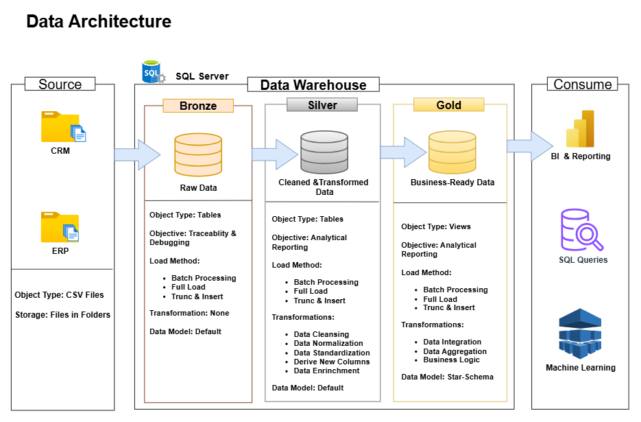
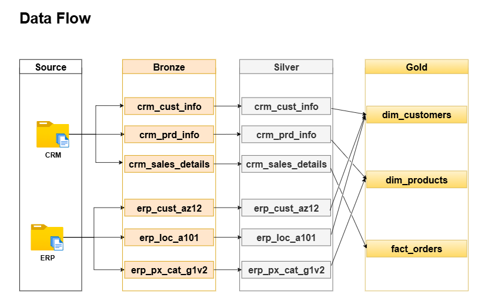
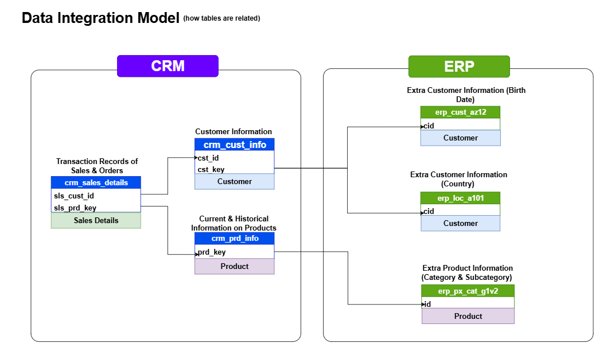
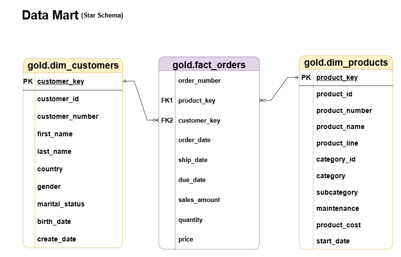

# From Raw Data to Revenue Insight — An E-Commerce Analytics Deep Dive

> *What does a business look like when you strip it down to its data?*
> This project takes six messy, disconnected e-commerce sources and builds a clean,
> integrated analytical system — uncovering revenue patterns, customer segments, and
> product trends through rigorous SQL analysis and Tableau visualisation.

---

## Project Overview

This is an end-to-end data analytics portfolio project built to mirror industry standards. Starting from six raw CSV files spanning two source systems (CRM and ERP), the project progresses through data engineering, statistical exploration, and advanced analytics, culminating in a set of executive-level Tableau dashboards.

The dataset covers **60,000+ e-commerce transactions** across a **4-year period (2010–2014)**, with records spanning customers, products, sales, and geography.

---

## Data Sources

The project draws from two simulated source systems:

**CRM System** — 3 files

| File | Description | Rows |
|---|---|---|
| cust_info.csv | Customer demographics and profile data | 18,000+ |
| prd_info.csv | Product catalogue with pricing and categorisation | 397 |
| sales_details.csv | Transactional sales records | 60,000+ |

**ERP System** — 3 files

| File | Description | Rows |
|---|---|---|
| CUST_AZ12.csv | Customer date of birth and gender | 18,000+ |
| LOC_A101.csv | Customer country and location data | 18,000+ |
| PX_CAT_G1V2.csv | Product category and subcategory mapping | 37 |

---

## Project Requirements

### Specifications

- **Data Sources**: Six raw CSV files from two source systems (CRM and ERP) simulating a real-world multi-system e-commerce environment
- **Data Ingestion**: Load raw data into the data warehouse exactly as-is, preserving source integrity for traceability and debugging
- **Data Transformation**: Clean, standardise, and enrich raw data into an analytical-ready format, resolving all quality issues identified during inspection
- **Data Quality Checks**: Validate all transformations before data integration, ensuring no dirty data reaches the analytical layer
- **Data Integration**: Consolidate data from both source systems into a unified analytical model, resolving key mismatches and structural differences between systems
- **Exploratory Data Analytics**: Profile the data statistically and dimensionally to understand its shape, distribution, and business characteristics before drawing conclusions
- **Advanced Analytics**: Apply analytical techniques including trend analysis, performance benchmarking, customer segmentation, and Pareto analysis to generate actionable business intelligence
- **Documentation**: Provide clear documentation including a data dictionary, architecture diagrams, and inline SQL commentary for both technical and non-technical audiences

---

## Data Architecture

This project is built on the **Medallion Architecture**, a three-layer design that progressively refines raw data into clean, integrated, and business-ready information.

| Layer | Object Type | Objective |
|---|---|---|
| **Bronze** | Tables | Raw data loaded as-is — traceability & debugging |
| **Silver** | Tables | Cleaned, standardised, and enriched data |
| **Gold** | Views | Business-ready Star Schema for BI & reporting |

---

## Data Flow

Data moves unidirectionally through the layers. Bronze feeds Silver,
Silver feeds Gold. No layer reads from a layer above it.

---

## Data Integration Model

The data integration model illustrates how the six source tables across the CRM and ERP systems relate to each other, and how they are joined to form the unified gold layer.

---

## Data Model

The gold layer is structured as a **Star Schema** — `gold.fact_orders` at the centre, joined to `gold.dim_customers` and `gold.dim_products`.

---

## Project Phases

### Phase 1 — Project Setup
Repository initialisation, folder structure, branch strategy, and project documentation.

### Phase 2 — Data Loading
All six CSV files loaded into bronze staging tables via a stored procedure with embedded logging — capturing load duration, row counts, and error details per table.

### Phase 3 — Data Quality Checks & Cleaning
Systematic identification and resolution of data quality issues across all six source tables — including null handling, date format conversion, whitespace trimming, gender standardisation, customer deduplication, product history correction, and sales integrity validation. A dedicated test script validates every silver layer output before integration proceeds.

### Phase 4 — Data Integration
CRM and ERP source systems joined into a unified analytical model. Key format mismatches resolved, product category bridge built, and dimension and fact views created as the gold layer foundation.

### Phase 5a — Exploratory Data Analytics
Six structured explorations across the gold layer — database profiling, date range analysis, dimension cardinality, descriptive statistics, magnitude analysis, and ranking analysis. Statistical techniques applied include distribution analysis, percentile profiling, IQR-based outlier detection, and Coefficient of Variation testing.

### Phase 5b — Advanced Data Analytics
Six analytical techniques applied to surface deeper business insights:

- **Change-Over-Time Analysis** — yearly and monthly performance trends with YoY growth rates and a 3-month moving average to reveal the underlying business trend
- **Cumulative Analysis** — running revenue and profit totals showing how fast the business compounds value over time
- **Performance Analysis** — products and countries benchmarked against their own historical averages and against the overall catalogue; customer retention rate tracked year over year
- **Data Segmentation** — customers and products classified using a composite performance score and an RFM model calibrated to the durable goods nature of the business
- **Part-to-Whole Analysis** — Pareto validation, revenue concentration by category and country, and customer distribution across behavioural segments
- **Report Views** — `gold.customer_report` and `gold.product_report` consolidating all metrics and segment labels as Tableau-ready analytical objects

### Phase 6 — Tableau Dashboards
⏳ In progress — coming soon.

---

## Tools & Technologies

| Tool | Purpose |
|---|---|
| **SQL Server** | Database engine — data storage, transformation, and all analytics |
| **SSMS** | Interface for interacting with SQL Server |
| **Tableau** | Interactive executive dashboards (coming soon) |
| **GitHub** | Version control and project documentation |
| **Draw.io** | Architecture, data flow, integration model, and data model diagrams |
| **Notion** | Project planning and task management |

---

## Project Status

| Phase | Status |
|---|---|
| Phase 1 — Project Setup | ✅ Complete |
| Phase 2 — Data Loading | ✅ Complete |
| Phase 3 — Data Quality & Cleaning | ✅ Complete |
| Phase 4 — Data Integration | ✅ Complete |
| Phase 5a — Exploratory Data Analytics | ✅ Complete |
| Phase 5b — Advanced Analytics | ✅ Complete |
| Phase 6 — Tableau Dashboards | ⏳ In Progress |

---

## License

This project is licensed under the **MIT License**. You are free to use, modify, or share with proper attribution.

---

## About Me

Hi there! I'm **Otusanya Toyib Oluwatimilehin**, an Industrial Chemistry graduate from Olabisi Onabanjo University who made a deliberate pivot into data analytics — driven by a passion for turning raw, complex data into decisions that matter.

With a scientific background that sharpened my analytical thinking and attention to detail, I've been building practical, industry-standard skills across SQL, Tableau, and data modelling. This project represents that journey in action — not just learning tools, but applying them to real business problems the way a professional analyst would.

I'm currently seeking data analyst and data engineering roles where I can contribute rigorous thinking, clean analysis, and clear communication of insights.

📧 toyibotusanya@gmail.com
📞 07082154436

